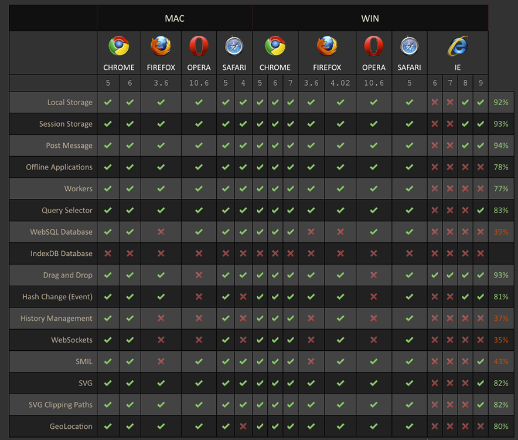
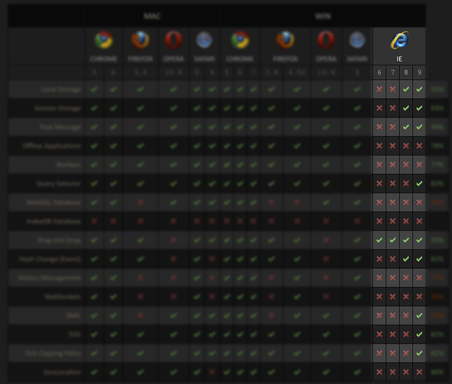
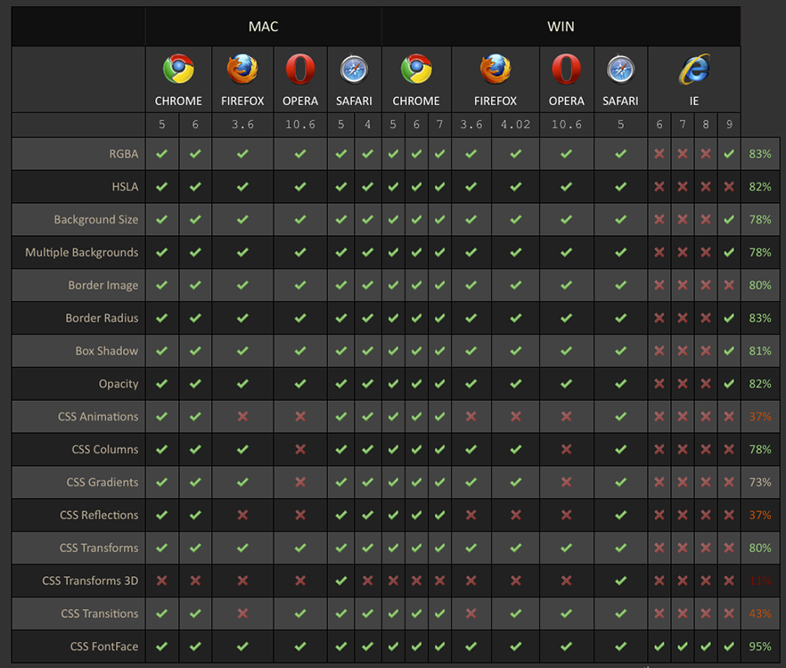
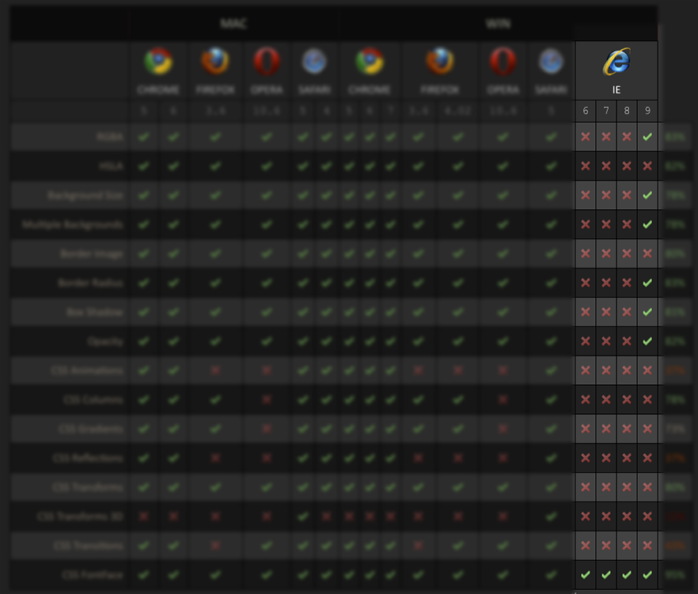

!SLIDE transition=fade
# HTML 5 & You #

!SLIDE center transition=fade

!SLIDE center transition=scrollUp

### "IE9 is really fast and awesome. It won't break your site like all our other browsers!" ###

!SLIDE center transition=scrollUp

### "CSS and Javascript are hard, here's a top secret prototype that works like After Effects" ###

!SLIDE center transition=scrollUp

### "HTML + JS + CSS make pretty cool apps. Btw we have a store for that." ###

!SLIDE center transition=scrollUp
# So What is HTML5, Anyway? #

!SLIDE bullets incremental transition=scrollUp smaller
# CSS3: Styling & Layout #

* Custom Fonts
* Drop Shadows
* Border Images
* CSS Animations
* CSS Transitions
* Columns
* Media Queries

* [http://designlovr.com/examples/dynamic_stack_of_index_cards/](http://designlovr.com/examples/dynamic_stack_of_index_cards/)

!SLIDE bullets incremental transition=scrollUp
# Rendering & Acceleration #

* 2D Vector Rendering (SVG)
* 2D Bitmap Rendering (Canvas)
* 3D Rendering (WebGL)

* [JBum Example](#)

!SLIDE bullets incremental transition=scrollUp
# APIs & Integration #

* Local Storage
* Web Workers
* Web Sockets
* Geolocation

* [http://wg.peepcode.com](http://wg.peepcode.com)

!SLIDE bullets incremental transition=scrollUp
# Multimedia #

* Video
* Mp4
* WebM
* OGV
* Audio

* [http://guttman.digisynd.com:5000](http://guttman.digisynd.com:5000)

!SLIDE center transition=scrollUp

!SLIDE center transition=fade

!SLIDE center transition=scrollLeft

!SLIDE center transition=fade
